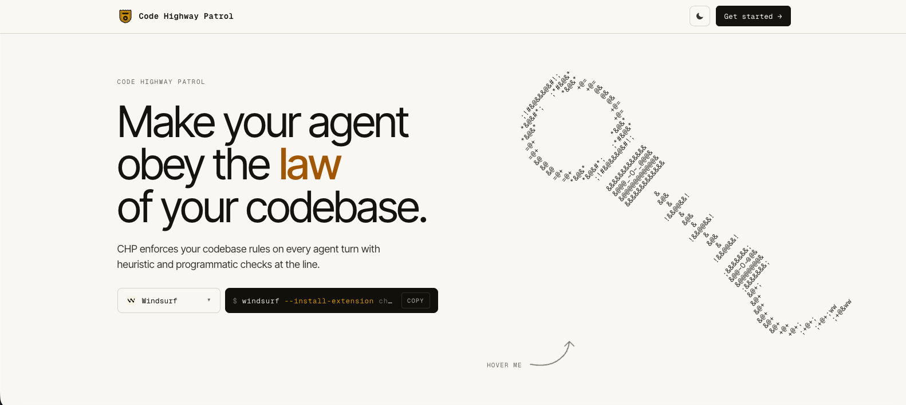

<h1 align="center">🚦 chp-web</h1>

<p align="center"><i>Marketing site for Code Highway Patrol.</i></p>

<p align="center">
  
  
  
</p>

###

<p align="center">
  
</p>

###

<div align="center">
  
  
  
  
  
  
  
  
  
</div>

###

## About

The public landing page for [Code Highway Patrol](https://github.com/code-highway-patrol). Single page React app, no router, deployed on Vercel. Cloudinary handles asset transformations; the cuffs in the hero are real-time ASCII rendered from a 3D torus on canvas.

## Stack

- React 19 + TypeScript
- Vite (dev server, build)
- Bun (package manager, lockfile)
- Cloudinary (`@cloudinary/react`, `@cloudinary/url-gen`)
- Vercel (deploy)

## Quick start

```bash
bun install
bun run dev      # http://localhost:5173
bun run build    # tsc -b && vite build
bun run lint     # eslint
```

## Environment

Create a `.env` in the project root:

```
VITE_CLOUDINARY_CLOUD_NAME=your-cloud-name
VITE_CLOUDINARY_UPLOAD_PRESET=your-unsigned-preset
```

Both must be prefixed `VITE_` so Vite exposes them to the client. Restart the dev server after edits.

## Structure

```
src/
  App.tsx            page composition
  Hero.tsx           headline + ASCII cuffs
  Cuffs.tsx          torus-to-ASCII renderer
  ScrollScene.tsx    pinned scroll-driven code review demo
  Compare.tsx        feature comparison table
  CTA.tsx            footer call to action
  cloudinary/        shared Cloudinary instance + upload widget
  index.css          all styles, no UI kit
```

## Roadmap

- [ ] Replace ASCII cuffs hero with an optional video loop
- [ ] Interactive playground for live patrol output
- [ ] Wire up the upload widget for user-submitted screenshots
- [ ] Light theme polish pass
- [ ] Open Graph preview card

###

<p align="center">Built at <a href="https://lahacks.com">LA Hacks 2026</a> 🐻</p>
